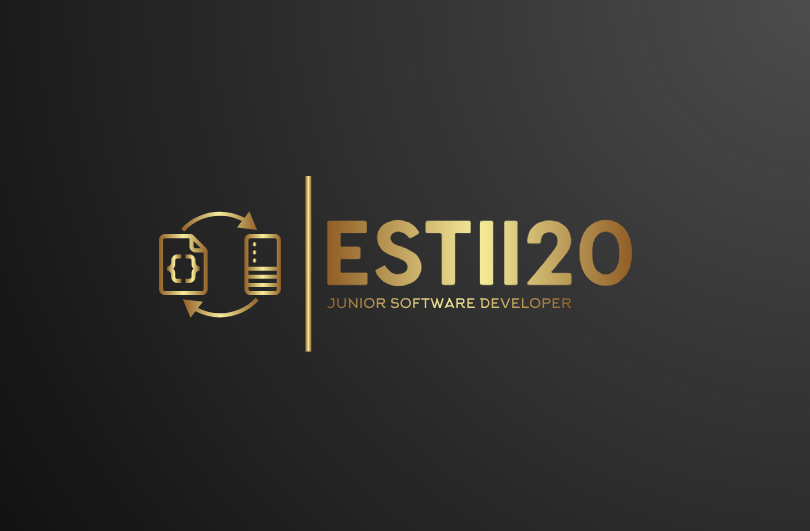

# estii20 README.md

Hello 👋🏼
I am Estelle, I am a recently qualified Junior Software Developer. I'm currently working on my portfolio website.

My current stack includes:

Languages - HTML & CSS 💻 JavaScript ☕📃 Python 🐍 C#
Frameworks & Libraries - Django, Flask, FlaskMail, Werkzeug, JQuery, Bootstrap, Materlize, Dataminer
Databases - MongoDB & MySQL
APIs - Google Maps, Cloudinary, EmailJS
Deployment- Github Pages, Heroku

Want to get in contact?
Send me a message on [Linkedin](https://www.linkedin.com/in/estelle-specht-947ba526/) 

## Highlighted Projects

### [Perfect Pointes](https://github.com/estii20/perfect_pointes) 

I used to be a professional dancer, so I was really excited to use my dance knowledge to create an e-commerce website for pointe shoes. This was my final project for the [Code Institute Fullstack Diploma](https://codeinstitute.net/global/full-stack-software-development-diploma/?nab=2&utm_referrer=https%3A%2F%2Fwww.google.com%2F) 

### [Ekotera](https://github.com/estii20/eko-tera)

I'm currently working on this website for a company that installs solar carports. They have a strong environmental ethos and have some big carport projects for hotel groups in Croatia.
